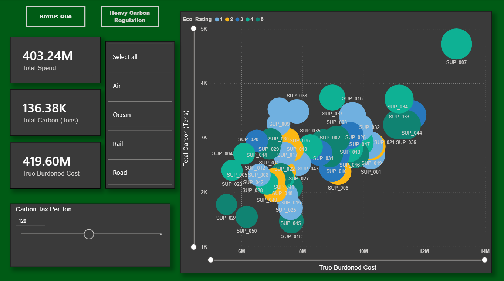

#Green Supply Chain & Logistics Optimization Engine

#Project Abstract
A data-driven simulation engine designed to evaluate global supply chain carbon efficiency against freight spend. This project bridges systems engineering with operations management, providing a framework to identify carbon mitigation opportunities without compromising bottom-line margins. 

#Key Quantified Impact
* **Data Architecture:** Engineered a Python script generating 10,000+ realistic logistics transactions, embedding operational friction metrics (transit speed vs. carbon output).
* **Data Warehouse:** Built a relational SQL database utilizing advanced joins and views to calculate baseline freight spend and CO2 mass.
* **Interactive Simulation:** Designed an executive Power BI dashboard featuring a dynamic "Carbon Surcharge" DAX parameter, allowing operations leaders to simulate risk exposure under evolving global carbon pricing frameworks ($0–$250/Ton).
* **Strategic Outcome:** Identified operational inefficiencies, proving that shifting low-urgency cargo from Air to Ocean freight becomes the most financially viable path when carbon is taxed at >$40/Ton.

#Tech Stack
* **Python** (Pandas, Numpy) for synthetic data modeling and randomized state generation.
* **MySQL** for relational database architecture and query optimization.
* **Power BI & DAX** for interactive UI/UX, measure calculation, and dynamic financial matrix modeling.

#Repository Structure
* `/1_data_generation/`: Contains the Python script used to model the network and export the baseline CSVs.
* `/2_sql_warehouse/`: Contains the DDL for the database schema and the analytical views.
* `/3_powerbi_dashboard/`: Contains the `.pbix` file housing the semantic model, DAX measures, and UI/UX.
